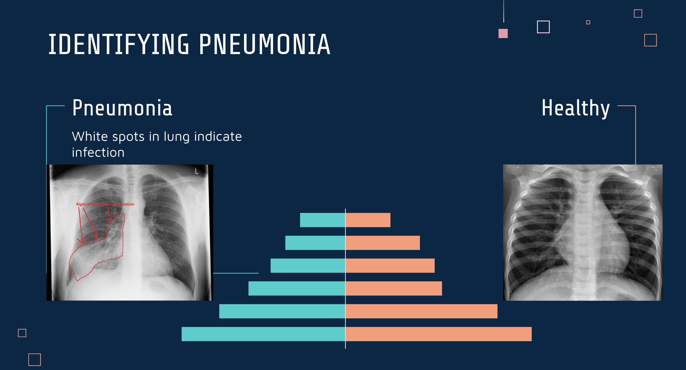
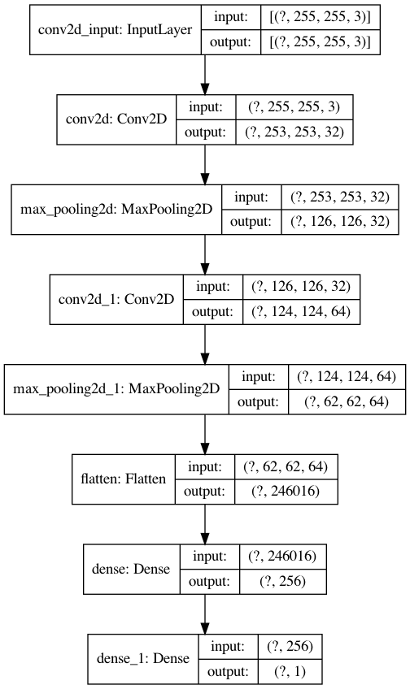
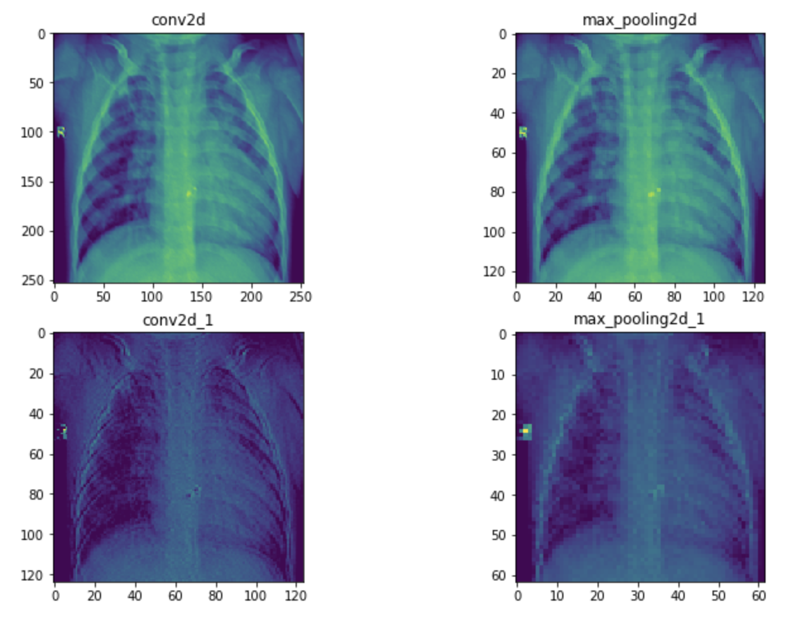
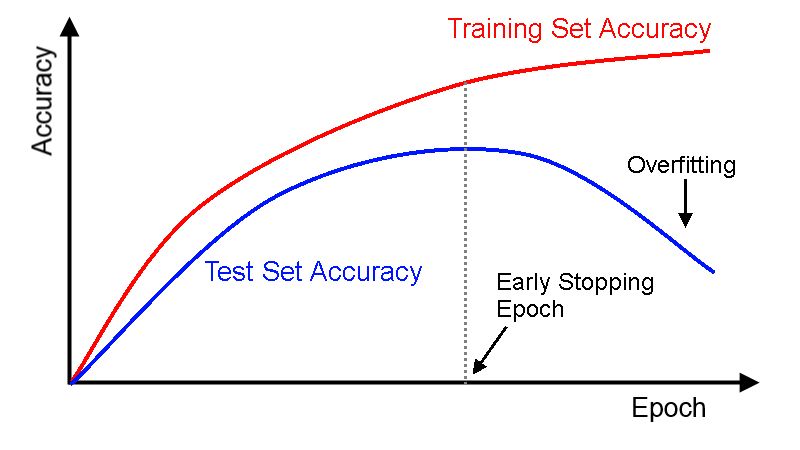

# Pneumonia X-ray Image Classification

Author: Hogan Byun

## Project Overview

The goal of this project is to train a neural network to identify whether a patient has pneumonia based on his/her chest x-ray. This project utilized neural networks and convolutional neural networks, ultimately opting for the latter as they are more well-suited for image classification tasks.

Usually, a doctor will view x-rays to identify pneumonia. The main thing to look for are white spots in the lungs. 

## Data

All the data has been curated from Kaggle. The original dataset is provided by Kermany et al.: https://www.kaggle.com/andrewmvd/pediatric-pneumonia-chest-xray

The data contains 5,856 total chest x-rays, of which, 4,273 are of pneumonia and 1583 are healthy. 

## Methods

As stated earlier, this project uses (convolutional) neural netoworks to classify images while following the OSEMN data science process. Python 3, Keras, and Tensorflow were used to achieve this.

## Results

The final model structure is shown below:

We used two Conv2D and MaxPooling layers before flattening into our Dense layers. In terms of regularization, Dropout and l2 regularization was used. Our optimizer was the Adam function. Our training set contained 5,232 images while our validation and test set contained 374 and 250 images, respectively.

Below is an example of how the layers work. As an image passes through more and more layers, the model is supposed to recognize more abstract patterns. We can see that the example image becomes more pixelated as it passes through each layer.

Our accuracy, loss results are below:
- Training: accuracy = 89.18%, loss = .8408
- Validation: accuracy = 90.91%, loss = .7220
- Test: accuracy = 87.20%, loss = .7364

Overall, the accuracies and the losses for all three of these sets are pretty close in value. However, improvements can be made.

## Future Work

This model is far from perfect and does warrant more changes in the future, those being, addressing overfitting, differentiating pneumonias, and applying to other diseases.

**Addressing Overfitting**

Convolutional Neural Networks have a tendency to overfit more often that underfit. When a model is overfit, it basically memorizes  the training data, rather than recognizing overall patterns. A clear indication of this is divergent accuracy and loss curves for the training and validation sets.

As a model trains, it generally starts out underfit until a converges to a best fit. Afterwards, further training would result in the model being overfit. The issue with our model is that this "best" fit is reached by the 2nd epoch. When a model jumps to a "best" fit too quickly, there's a very high chance that it'll skip over the actual best fit. Further modifications (decrease complexity, more regularization, data augmentation) should help address this.

**Differentiating Pneumonias**

There are two main types of pneumonia: bacterial and viral. This project does not address the different types and only focuses on identifying healthy vs. pneumonia. Though these two types are both types of pneumonia, the treatments for these are very different. Usually, viral pneumonia can be treated from home, but bacterial pneumonia requires the use of antibiotics. Developing a model that can differentiate between the two would prove to be worthwhile.

**Applying to other diseases**

Once a model that can reliably detect pneumonia is made, it could be worthwhile to evolve from binary classification by developing a model that can identify multiple diseases.